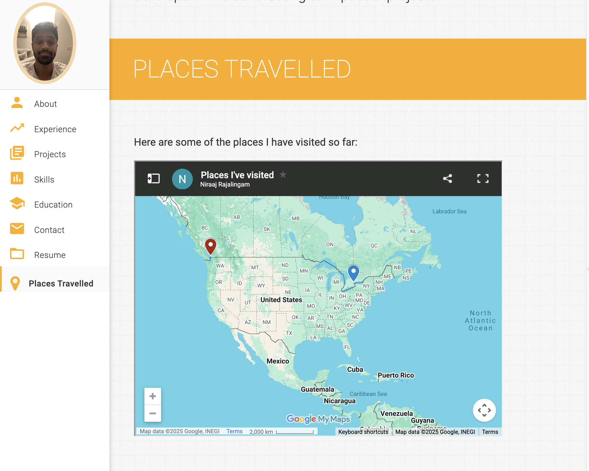
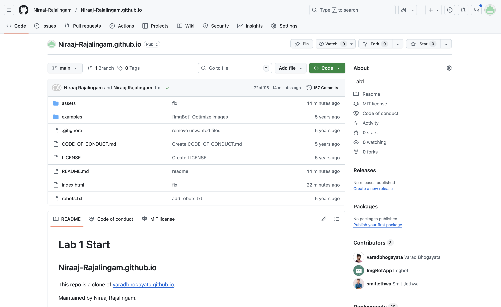

# Lab 1 Start
## Niraaj-Rajalingam.github.io

This repo is a clone of [varadbhogayata.github.io](https://github.com/varadbhogayata/varadbhogayata.github.io).

Maintained by Niraaj Rajalingam.

## Activity 1

## Activity 2

## Activity 3 

## Activity 4

## Activity 5

